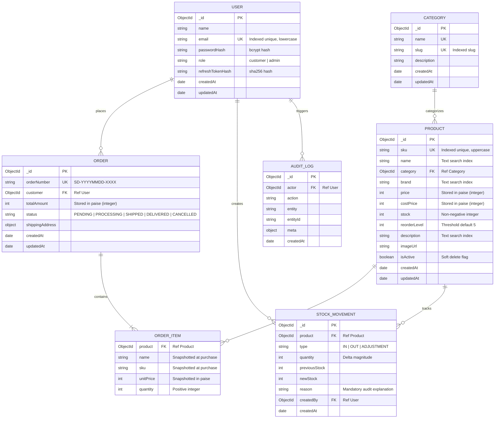

# StockDrive IMS — Entity Relationship (ER) Diagram

```mermaid
erDiagram
    USER ||--o{ ORDER : places
    USER ||--o{ STOCK_MOVEMENT : creates
    USER ||--o{ AUDIT_LOG : triggers
    CATEGORY ||--o{ PRODUCT : categorizes
    PRODUCT ||--o{ ORDER_ITEM : snapshotted_into
    PRODUCT ||--o{ STOCK_MOVEMENT : tracks

    USER {
        ObjectId _id PK
        string name
        string email UK "Indexed unique, lowercase"
        string passwordHash "bcrypt hash"
        string role "customer | admin"
        string refreshTokenHash "sha256 hash"
        date createdAt
        date updatedAt
    }

    CATEGORY {
        ObjectId _id PK
        string name UK
        string slug UK "Indexed slug"
        string description
        date createdAt
        date updatedAt
    }

    PRODUCT {
        ObjectId _id PK
        string sku UK "Indexed unique, uppercase"
        string name "Text search index"
        ObjectId category FK "Ref Category"
        string brand "Text search index"
        int price "Stored in paise (integer)"
        int costPrice "Stored in paise (integer)"
        int stock "Non-negative integer"
        int reorderLevel "Threshold default 5"
        string description "Text search index"
        string imageUrl
        boolean isActive "Soft delete flag"
        date createdAt
        date updatedAt
    }

    ORDER {
        ObjectId _id PK
        string orderNumber UK "SD-YYYYMMDD-XXXX"
        ObjectId customer FK "Ref User"
        int totalAmount "Stored in paise (integer)"
        string status "PENDING | PROCESSING | SHIPPED | DELIVERED | CANCELLED"
        object shippingAddress
        date createdAt
        date updatedAt
    }

    ORDER_ITEM {
        ObjectId product FK "Ref Product"
        string name "Snapshotted at purchase"
        string sku "Snapshotted at purchase"
        int unitPrice "Snapshotted in paise"
        int quantity "Positive integer"
    }

    STOCK_MOVEMENT {
        ObjectId _id PK
        ObjectId product FK "Ref Product"
        string type "IN | OUT | ADJUSTMENT"
        int quantity "Delta magnitude"
        int previousStock
        int newStock
        string reason "Mandatory audit explanation"
        ObjectId createdBy FK "Ref User"
        date createdAt
    }

    AUDIT_LOG {
        ObjectId _id PK
        ObjectId actor FK "Ref User"
        string action
        string entity
        string entityId
        object meta
        date createdAt
    }

    ORDER ||--|{ ORDER_ITEM : contains
```
